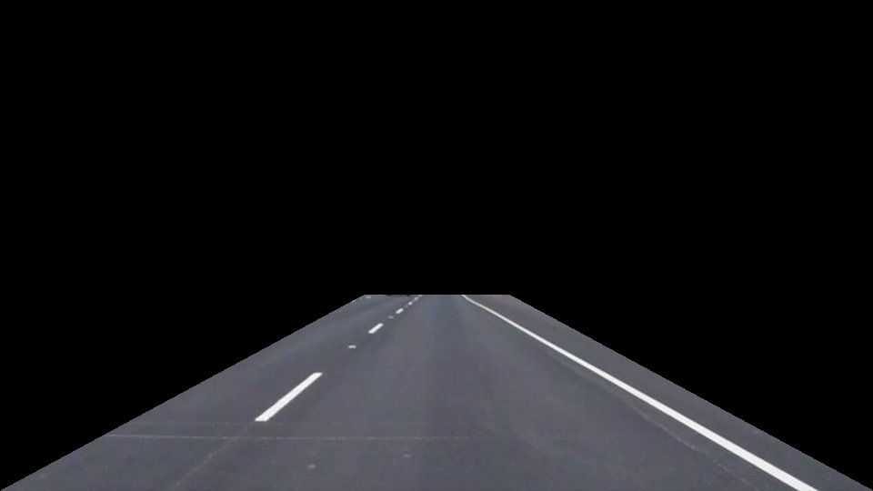
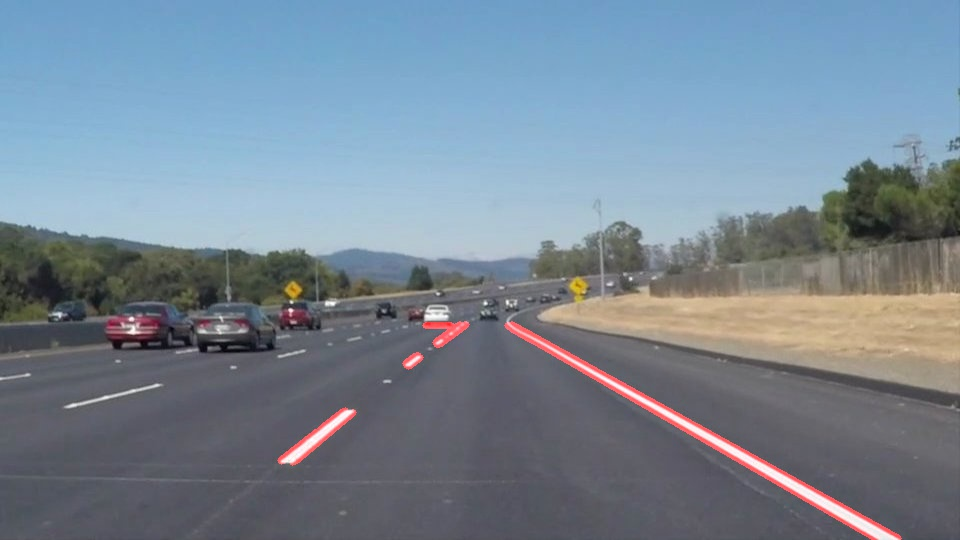
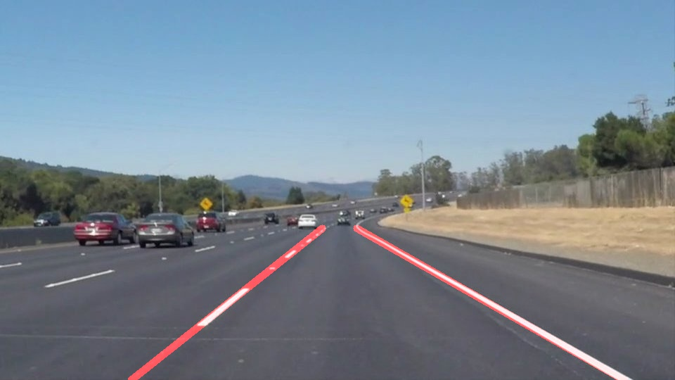
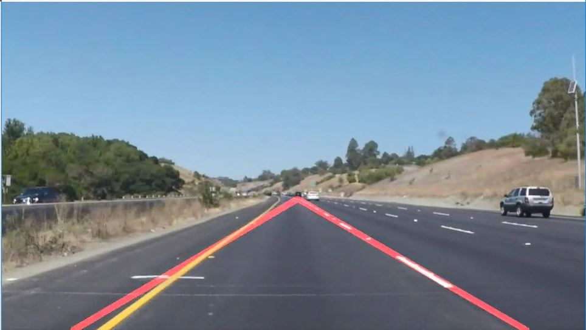
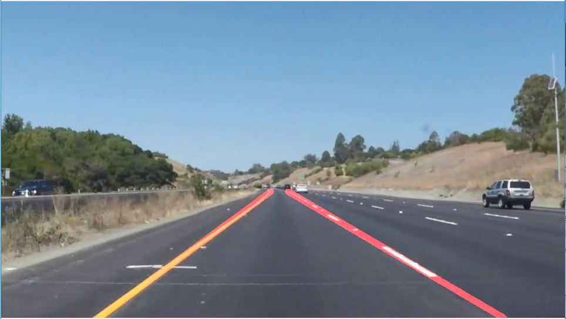
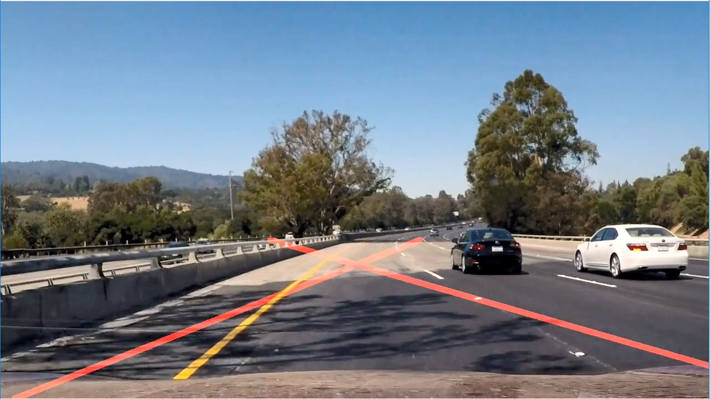
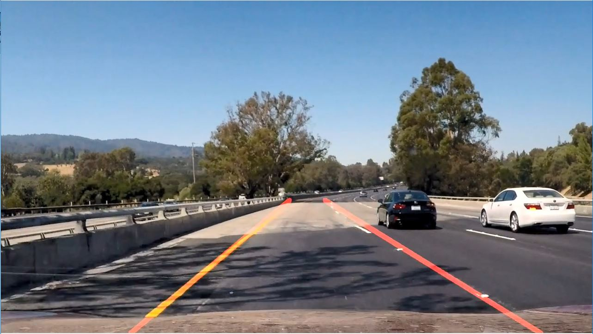

# **Finding Lane Lines on the Road** 

## Writeup

### This describes the journey of the Finding Lane Lines project, including the explanation of the pipeline and it's reasoning, and the problems and results that shape the final alogirthm.

---

**Finding Lane Lines on the Road**

The steps of this project are the following:
* Make a pipeline that finds lines on road images
* Average and/or extrapolate the lines to find a single line on the left and a single line on the right
* Apply the pipeline to videos
* Improve it for the optional challenge
* Reflection

---

### Reflection

### 1. Describe your pipeline. As part of the description, explain how you modified the draw_lines() function.

My pipeline consisted of 6 steps. These are:
- Grayscale
  Just a simple conversion to grayscale image. 

- Gaussian blur
  Apply gaussian blur to smooth the image before detecting edges using canny.

- Canny Edge Detection
  Apply canny edge detection to brings up all the edges in the image.

- Masking region of interest
  Apply masking so that the next steps will only process the designated region of interest. Here I set the polygon mask to `(0, image_height), (image_length*5/12, image_height*3/5), (image_length*7/12, image_height*3/5), (image_length, image_height)`. Image below show the masked area.
  

- Hough Lines Detection
  Apply hough lines detection to get all the possible lines in the image. Here I set the parameters to these values.
  ```
  rho = 1
  theta = np.pi/180
  threshold = 10
  min_line_len = 10
  max_line_gap = 10
  ```
  Rho and theta is the default 1 and np.pi/180, which is the most detailed resolution. Threshold, min_line_len, and max_line_gap is the value after several times of trial-and-error using the provided test images.

  Below is an example of detected lines in an image.
  

- Outlier lines removal
  In order to get the best averaged line, there is a need to remove the outlier lines. There are many definitions of outlier, but here I use the inter-quartile-range(IQR) properties of data to define and remove outliers. Below is the definition of IQR and min, max, the point where data beyond it is considered outlier.
  ```
  IQR = Q3 - Q1
  min = Q1 - (IQR*1.5)
  max = Q3 + (IQR*1.5)
  ``` 
  Now, what is considered data in lines? Intuitively, one can say the m and b in the line equation `y = mx + b` can be the data, and indeed that is what I will use here. I will remove the lines which have outlier m and/or b.

  However, there are many lines detected in the image with various lengths. How can we weight the data so that it is proportional to the length of the lines? Here I introduce a list, in which the data will be included multiple times according to it's line's length. Using this list, we can have data which honor the length of the lines, and using the IQR technique explained above, I remove the lines with outlier m and then the lines with outlier b. Below is an example image with it's outlier lines removed.
  

- Line averaging and extrapolation
  Now that the outlier lines are removed we can easily do averaging. To average the lines, we just average it's m and b values. However, to honor the lines lenghts, here I multiply the m/b values of a line with it's length, sum it over all the lines, and finally divide it by the the total length of the lines.

  For extrapolation, I just simply stretch the averaged line from the bottom to the top of the masked region.
  
  Below is an example image with the averaged line found and extrapolated.
  

- Remove horizontal-like lines (handle solidYellowLeft.mp4)
  Using the above pipeline, in all the test images and the first test video the lane lines can be detected with relative accuracy. However, in the second test video, there are a few frame in which the lane detection is producing inaccurate detection. Below is an example.
  

  There is a common thing in all these error inducing frames, they all have some relatively long horizontal-like lines. With the outlier removal explained above, the line's length is honored, which means if there is a relatively long line, it will not be removed even if it's m/b value is a relative outlier. In order to remove these horizontal-like lines, I implement 'horizontal-like lines removal' before the outlier removal explained above. The rule is to just simply remove all lines with slope (m value) between -0.1 or 0.1.

  Below is an example after applying horizontal-like line removal.
  

- Increase horizontal-like slope limit (handle optional challenge)
  In the challenge video test, using the above pipeline, there are many inaccurate detection. After looking at the hough lines of the frames, one can see that there are too many erroneous line which are not part of the lane lines. Most of this line have much smaller or higher slopes then the lane line. So, in order to handle it, I increase the horizontal-like line slope criteria to be between -0.4 and 0.4. Using this, the detection runs much better with more than 95% is seen to be relatively accurate.

  Below are the before after of the challenge video.
  
  

### 2. Identify potential shortcomings with your current pipeline

There are a few shortcomings that I can think of. The first one is the mask area. If somehow the camera position is changed and the lane lines fall outside the masked area, then that will be a big problem.

Another shortcoming is with the horizontal-like lane removal. This is a very simple solution yet a very bad thing to do, because by using it we assume that the lane lines will never have slope that falls inside the horizontal-like slope limit, which it can if the lane lines are curved or the camera position changed.

### 3. Suggest possible improvements to your pipeline

Regarding the mask area, a possible improvement would be to expand it, with the disadvantage of having to deal with more noise lines, particularly the area outside the road. However it can handle more variation of position of the lane lines.

Regarding erroneous detection in the second test video, one improvement is to do outlier removal without honoring the lines' length. That way, the erroneous line can theoretically be removed even if it has long length.
